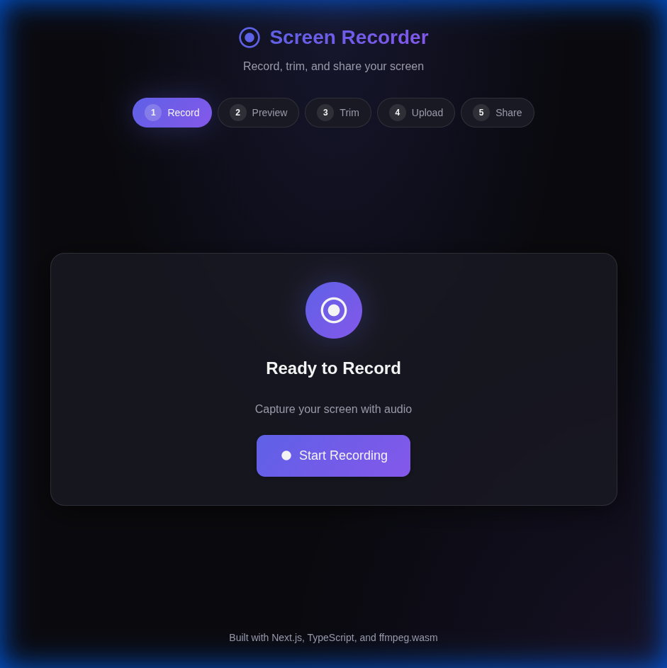

# Screen Recorder MVP

A full-featured browser-based screen recording application built with Next.js, TypeScript, and ffmpeg.wasm.



## Features

### 🎬 Screen Recording
- Record screen with system audio and microphone
- Real-time recording indicator with timer
- Pause/resume recording functionality
- MediaRecorder API for native browser recording

### ✂️ Video Trimming
- Client-side video trimming using ffmpeg.wasm
- Dual-range slider for precise start/end selection
- Preview trimmed segment before applying
- Zero server load - all processing in browser

### 🔗 Upload & Share
- Upload recorded videos to server storage
- Generate unique shareable links
- Public video player page
- One-click copy to clipboard

### 📊 Analytics
- Track view counts per video
- Monitor watch completion percentage
- Record watch duration
- SQLite database for persistence

## Tech Stack

- **Frontend**: Next.js 16, React 19, TypeScript
- **Styling**: Tailwind CSS 4 with custom dark theme
- **Video Processing**: ffmpeg.wasm (client-side)
- **Database**: SQLite with better-sqlite3
- **Storage**: Local file system (mocked S3)

## Getting Started

### Prerequisites

- Node.js 18+ or Bun 1.0+
- Modern browser with MediaRecorder support

### Installation

```bash
# Clone the repository
git clone https://github.com/tushargr0ver/screen-recorder-mvp.git
cd screen-recorder-mvp

# Install dependencies
bun install
# or
npm install

# Trust better-sqlite3 postinstall (for native compilation)
bun pm trust better-sqlite3

# Start development server
bun run dev
# or
npm run dev
```

Open [http://localhost:3000](http://localhost:3000) to use the app.

## Project Structure

```
app/
├── api/
│   ├── analytics/route.ts  # View & completion tracking
│   └── upload/route.ts     # Video upload handling
├── components/
│   ├── ScreenRecorder.tsx  # Main recording UI
│   ├── VideoPreview.tsx    # Recorded video display
│   ├── VideoTrimmer.tsx    # ffmpeg.wasm trimming
│   ├── UploadButton.tsx    # Upload with progress
│   ├── ShareLink.tsx       # Share link display
│   └── WatchTracker.tsx    # Analytics tracker
├── contexts/
│   └── RecordingContext.tsx # Recording state management
├── lib/
│   └── db.ts               # SQLite database layer
├── watch/
│   └── [id]/               # Public video player
├── globals.css             # Dark theme styling
├── layout.tsx
└── page.tsx                # Main app flow
```

## Architecture Decisions

### Client-Side Video Processing
Using `ffmpeg.wasm` for video trimming means:
- ✅ No server-side video processing needed
- ✅ Works on serverless platforms (Vercel)
- ✅ Lower infrastructure costs
- ⚠️ Initial load time for ffmpeg (3-5MB)

### SQLite for Analytics
Chose SQLite for simplicity:
- ✅ Zero configuration required
- ✅ File-based persistence
- ✅ Perfect for MVP/prototyping
- ⚠️ Single-instance only in production

### Local File Storage
Videos stored in `public/uploads/`:
- ✅ Simple implementation
- ✅ Served directly by Next.js
- ⚠️ Must migrate to S3/R2 for production

## Production Improvements

For a production-ready version, consider:

### Infrastructure
- [ ] Replace local storage with S3/R2/GCS
- [ ] Use PostgreSQL instead of SQLite
- [ ] Add CDN for video delivery
- [ ] Deploy behind a load balancer

### Features
- [ ] User authentication & accounts
- [ ] Video transcoding for multiple qualities
- [ ] Custom video player with chapters
- [ ] Video annotations/comments
- [ ] Team workspaces

### Performance
- [ ] Lazy load ffmpeg.wasm
- [ ] Video chunked upload
- [ ] HLS/DASH streaming
- [ ] Rate limiting on APIs

### Security
- [ ] Signed upload URLs
- [ ] Video access controls
- [ ] CORS configuration
- [ ] Input validation

## API Reference

### POST /api/upload
Upload a video file.

**Request**: `multipart/form-data` with `video` field

**Response**:
```json
{
  "success": true,
  "id": "uuid",
  "shareUrl": "/watch/uuid",
  "filename": "uuid.webm"
}
```

### POST /api/analytics
Record analytics events.

**Request**:
```json
{
  "action": "view" | "watch",
  "videoId": "uuid",
  "watchPercentage": 75,
  "watchDuration": 120,
  "completed": false
}
```

### GET /api/analytics?videoId=uuid
Get video statistics.

**Response**:
```json
{
  "views": 42,
  "completions": 10,
  "avgWatchPercentage": 68.5,
  "totalWatchTime": 3600
}
```

## Browser Support

- Chrome 88+
- Edge 88+
- Firefox 78+
- Safari 14+ (limited screen capture)

## License

MIT License - see [LICENSE](LICENSE) for details.
